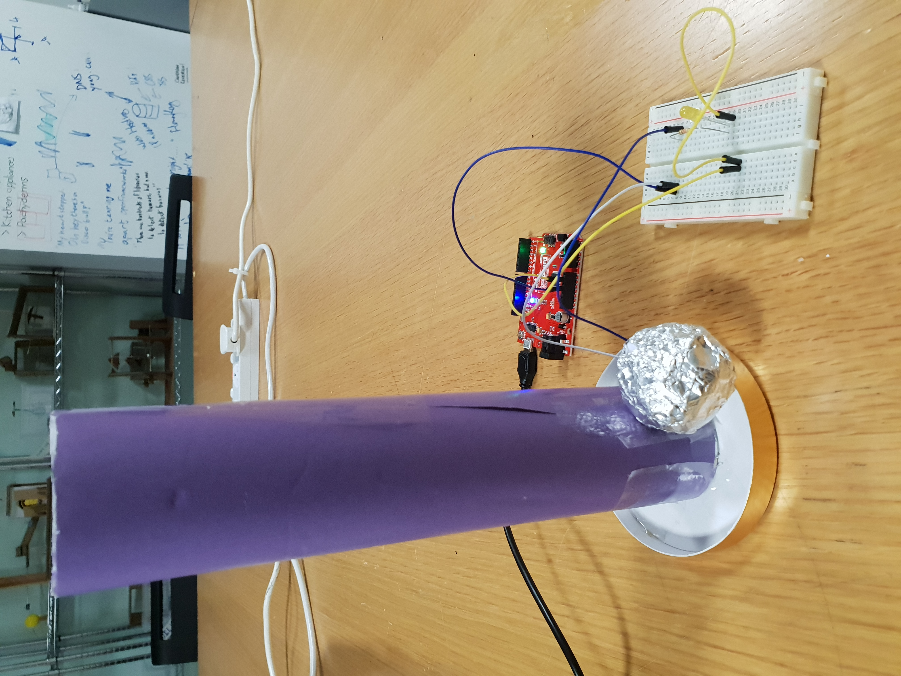
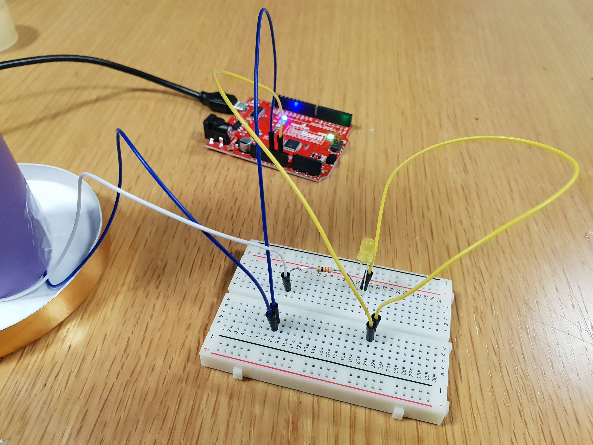

**Here is the description of my hands free switch**

My switch is a simple circuit consisting of an LED light, a resistor, connecting wires, a breadboard, and Arduino. To make a switch that didn’t use my hands, I added an element to this circuit; a tube with aluminium foil running down either side. When added to the circuit, the tube broke the circuit as the aluminium foil ran down either side but did not connect the sides. To connect the sides, and complete the assignment, I threw a ball covered in aluminium foil into the tube, which completed the circuit as it runs down the tube.

[Here](https://vimeo.com/389163452) is my video of the switch in action.
