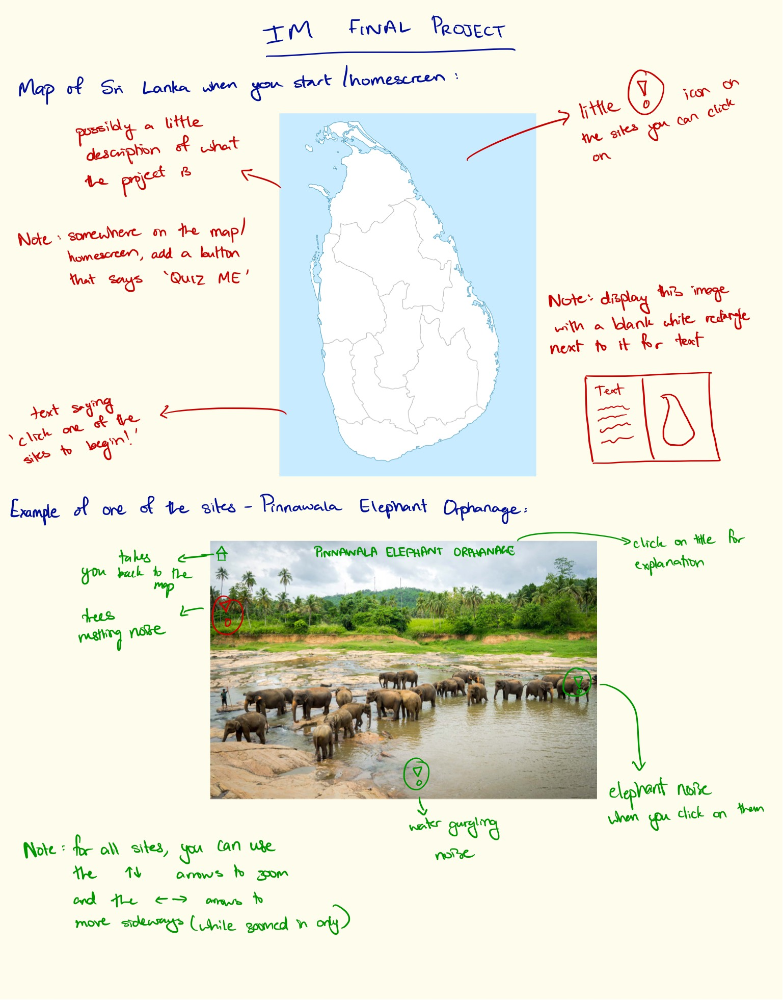
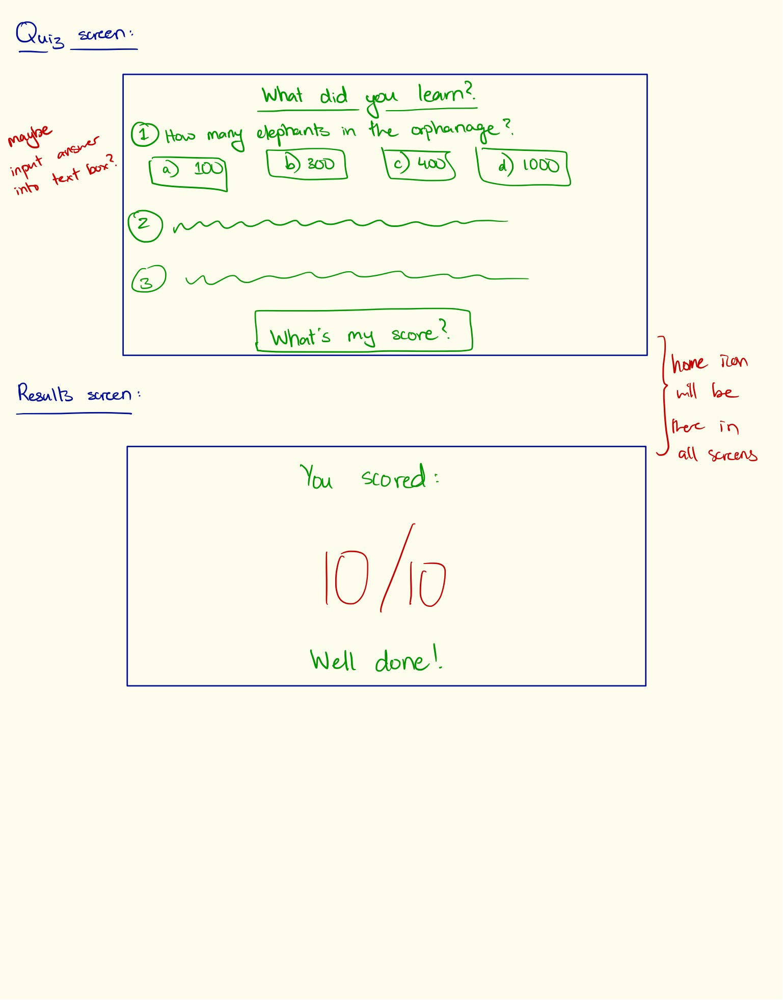

**Exploring Sri Lanka**

In light of the pandemic, I appreciate how natural parks and museums have virtually opened their doors to the public, allowing us to appreciate natural wonders of the world that we might not have previously dreamt of visiting, but now when confined to our own homes, have the opportunity to explore even if virtually. I think it's really special that we are finding ways to appreciate the world around us even more now that we are kept away from it. The idea from my project stemmed from the fact that I'm not able to travel to Sri Lanka for summer this year, missing out on one of my favourite parts of the year, where I get to explore the beautiful island. But this just made me want to find a way to bring it closer, even if that meant through a screen. And so 'Exploring Sri Lanka' began.

The aim of my final project is to create a virtual nature walk like the ones we are seeing in light of the pandemic. I would create a nature walk/tour for hidden nature gems in Sri Lanka. I thought this idea would work well with our final because there are many different components to these nature tours, and I could collect all the different tools of Programming that we learnt over this half of the semester and compile them into one project. 

I envision the tour starting out with a map of Sri Lanka, where you can click on the different regions of the country to view a different site in that region. Once you are taken to the site of your choice, you have multiple options to explore the site. One way would be to click on the animals/waterfalls/noise generating object in the image to hear the sounds of nature. Another way you can interact with the site is to use your arrow keys to zoom in or out, and move side to side. I also want to include a little explanation bubble at the side of each site so that you can click on it to read a little explanation of the site. I'm also hoping to include a little quiz you can do at the end of the tour, after going through all the explanations. I want to include more features, and hopefully I will, once I continue working on my code and discover new possibilities. 

**Sketch of final project plan:

