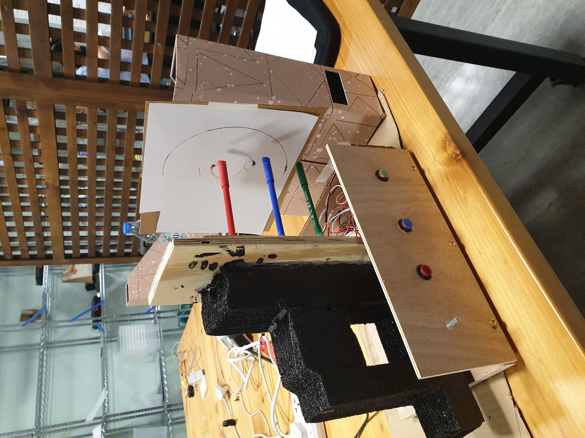
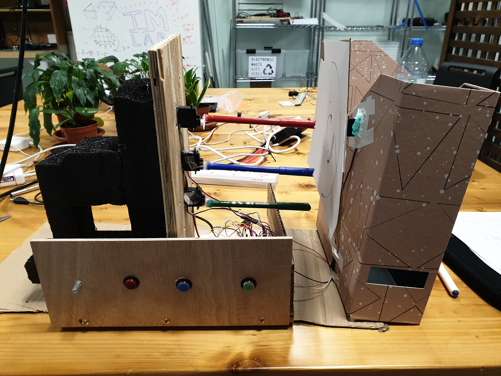
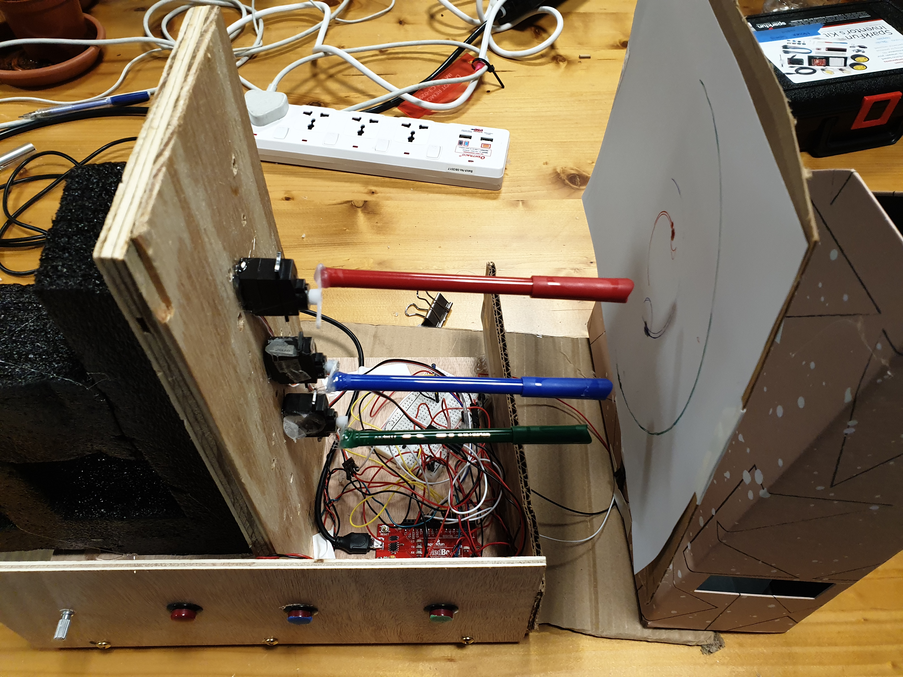

**Circle Art**

My inspiration for my midterm project came from the geometric designs in Islamic art and architecture. I love observing the different intricate patterns that can be created using basic shapes, and so I wanted to use Arduino to create an art piece that involved drawing circles to create different designs. As I am not artistically gifted, but I do appreciate art, I thought it would be fun to get Arduino to actually create the art, while the user could direct it. Creating something abstract and beautiful from a shape as mundane as a circle seemed like the kind of art that is accessible to everyone, artistically gifted or not, and so my midterm project aims to create an artform that everyone can use to express their creative processes.

Servos seemed to be the logical component to use to achieve this, but I then realised they would not create full circles. To add another element of interactivity, and to create full circles, I decided to add the feature of rotating the paper. My code included connecting a push button to each servo that rotated the markers, and one servo that was attached to the "canvas" and was controlled by a potentiometer. What I struggled with the most was the hardware aspect of putting my project together. I came across a technical problems throughout my assembly of the project, and I had to change my materials a few times. 

First, I realised that the markers I bought were made of plastic, and so using hot glue to stick them to servos was difficult, and sometimes resulted in the markers drooping a little and touching the canvas at different points. Then, I realised that the wooden board I used was too small to fit the circuitry and the canvas, so I added a stand that would hold the canvas off the wooden board. I learnt that having a rough blueprint for my project and measuring my base and components would have saved me a lot of time that I spent troubleshooting. I also learnt about how some materials need different means of adherence, and doing this project taught me more about the materials I used. 

Overall, I'm happy with my final product as it achieved the goal I had in mind at the outset of my project. The execution of the project was improvable, but I am sure that is one aspect of any project that will remain consistent, and for good reason. 

[Here](https://vimeo.com/395895054) is the video of my project 

**Pictures of the project**

