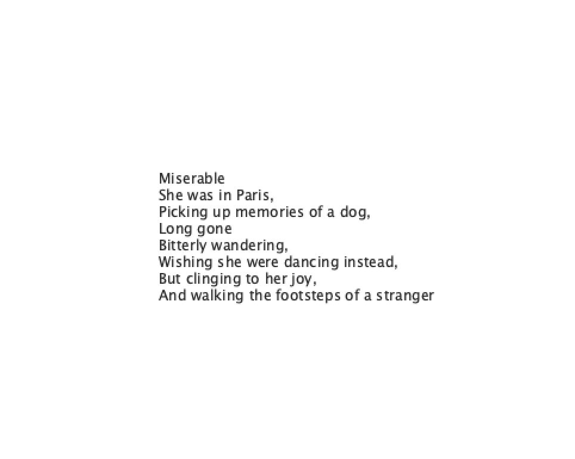

**POETRY VS MADLIBS**

When we learnt about generative text, the first thing that came to mind was playing madlibs when I was little, and finding it hilarious to read out the different jokes I unknowingly wrote. Cut to when I studied literature in the tenth grade and poetry sometimes felt like madlibs to me because it seemed to place words randomly, as long as they somewhat made grammatical sense, and evoke emotion. So I wanted to create a program that would either generate a madlibs-style text to make you laugh, or a poem which held meaning to you. 

My code is pretty simple, it uses a table in which I typed random words, some that would suit the default text, some that wouldn't. At first, I used code similar to: 'String adjective1 = rowAdjective.getFloat(1);'. But I couldn't randomize the words very easily and it was a much longer process. After I found out about getStringColumn, it was much easier to figure out the code. One thing I still need to figure out in my code is using the draw function to create a new poem/madlib every time you click the mouse. When I tried to do it in my code, it made the words fluctuate. If I can figure this out, it would be much better since you could reuse the program. 

