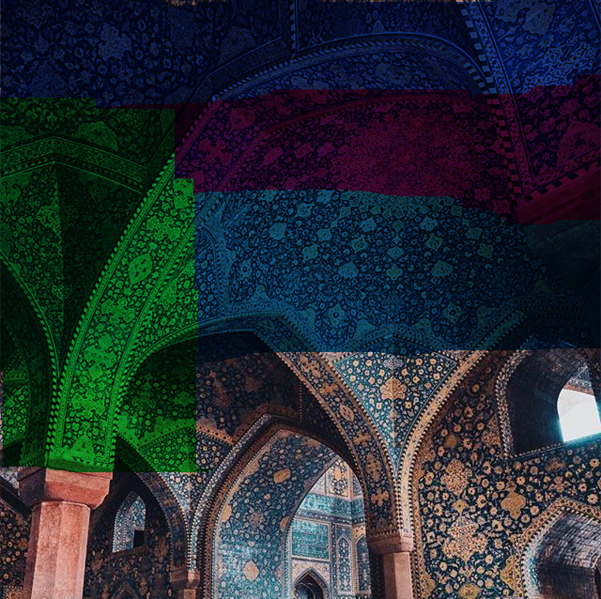

** Recreating Architecture **

Iranian Architecture is incredibly detailed, the more you look at it, the more detail emerges. I wanted to create a way to appreciate these details by highlighting them in a different way. And that's exactly what I did. Using the tint function in Processing, I gave the image different highlights so that different details stood out in different colours given how colourful the original image was. 

My initial idea for the code was to create a way to zoom into the image. I struggled with doing this, so I looked for other ways to highlight the details of the architecture. I would like to 

