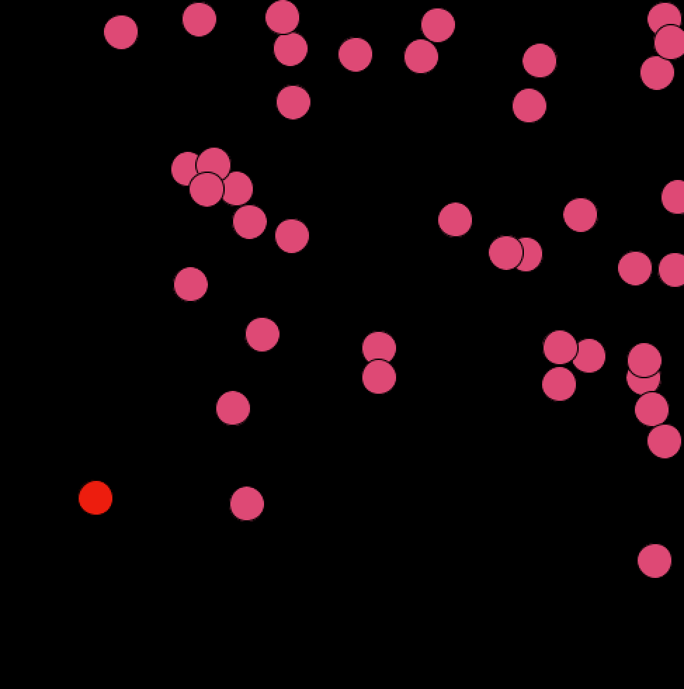

**The aim of the game is in the title. Click the Ball.**

I wanted to create a game that is very simple, but also frustrating. I thought of old phone games which have one intruction, but are made to be so difficult to win that you get frustrated, but addicted. Click the ball is similar, because all you have to do is click a red ball, but it's frustrating given that you have to be quick with clicking. 

In making the game, I struggled with making the main ball smaller every time you click it, which is a feature I wanted to include so that the game gets harder every time you click the ball. Every time I tried added the make the ball smaller code, it would show the you win screen after the first click. I need to find the error in my code that kept bringing up the wrong screen, so for now, I excluded that feature. To make up for it, I decreased the size of the main ball so that the game would be harder either way. 

