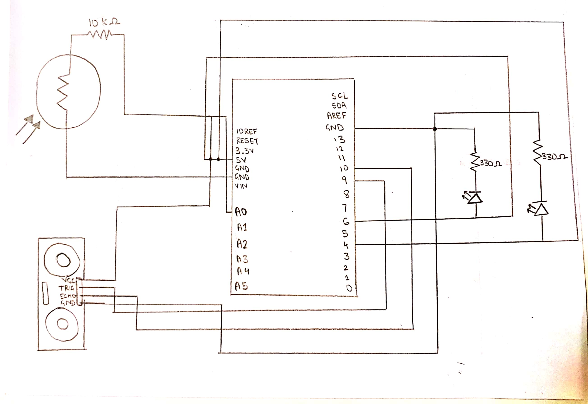

**Motion Sensor in the Dark**
My project uses an ultrasonic detector and a photoresistor to create a motion sensor in the dark. To indicate motion in the dark, I used LED lights. The blue LED light is on by default, until there is motion near the ultrasonic detector in the dark, which is when the blue LED turns off and the red LED turns on. I programmed the Arduino such that the blue light does not change unless there is both movement and a lack of light. When making the circuit, I struggled with determining values for the ultrasonic detector and photoresistor, however, once I used the serial monitor, it was easier to understand which values would work. 

**Schematic of circuit**

[Video of motion sensor](https://vimeo.com/390540446)
