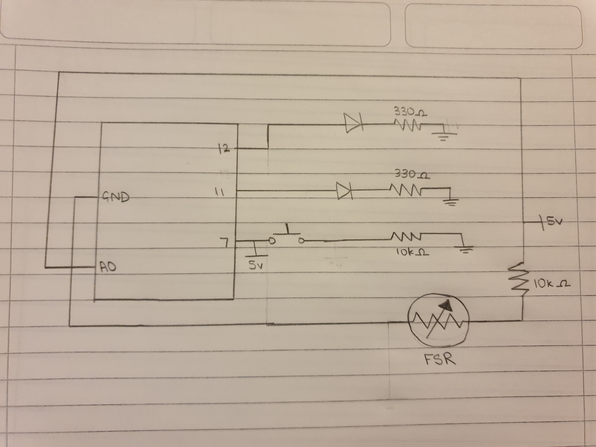

My idea for this project was to create a 'stress-sensor'. While my sensor simply measures force as stress, it uses a force meter to determine the force with which the force meter is squeezed and turns on a blue LED or yellow LED for low or high force respectively. To integrate a switch into my circuit, I used a pushbutton, which when pressed, makes the yellow LED turn on at low force and the blue LED turn on at high force. 

I struggled with using a switch for my circuit as I wanted to use one which would stay in an on or off state until switched back, but I was unable to form a code that would use the momentary switch that way. 

**Pictures:**

**Schematic:**

