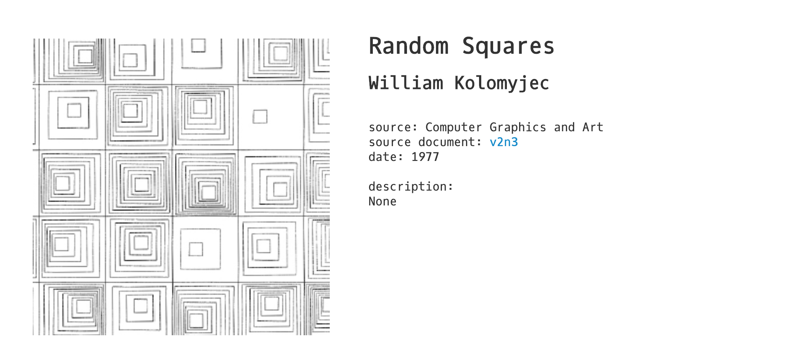
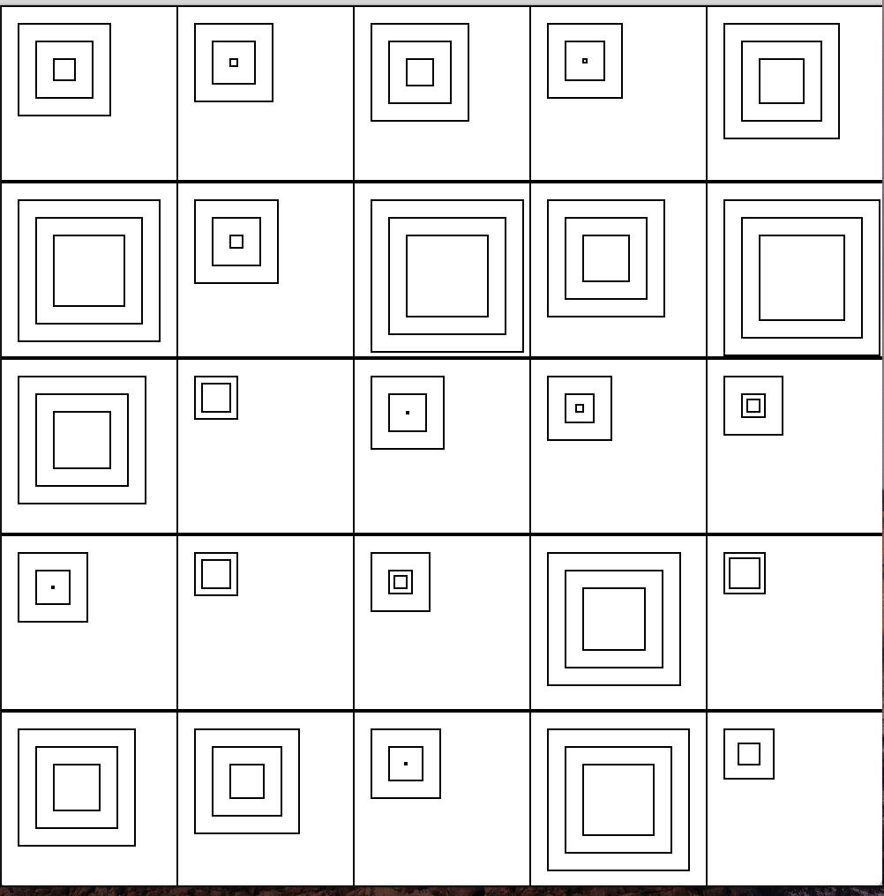

Here is the computer art I tried to recreate:

And here is my humble rendition:

There are evidently a few differences between the two. My main struggle with the code was using the function 'random' to randomly assign a number of mini squares to each grid box. So instead I had to repeat the function for mini squares a few times for each grid box and add some if statements to slightly randomize the number of mini squares, but this limited me to having a maximum number of mini squares which is much less than that of the original pattern, making my pattern look much more sparse than the original. I'd also like to figure out how to make the squares more rounded like the original and to have a more hand-drawn look. 

I feel as though there may have been better ways to alter my code, as I explain in comments within the code itself, but overall I'm happy to have gotten better at using 'random', for loops and translations. 
